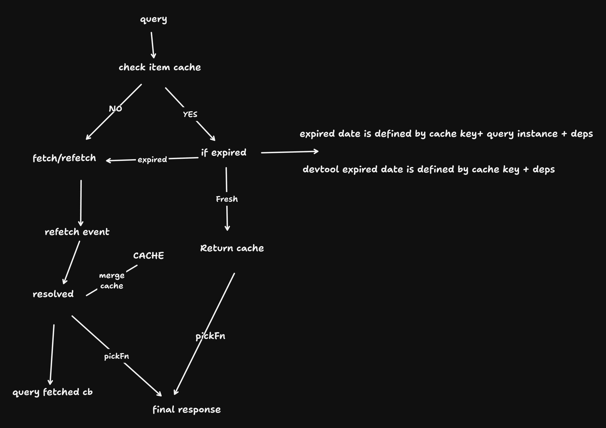

based on turbo-query (turbo)https://github.com/StudioLambda/TurboQuery

# this is experimental query library for svelte 5 runes that allows you to customie how cache is stored

# Quick Start

```shell
npm install svelte-query-custom
pnpm install svelte-query-custom
yarn install svelte-query-custom
bun install svelte-query-custom
```

```javascript
// layout.svelte
// you can use  QuiteClient or setQueryContext to set cache stores
import {QueryClient} from "svelte-query-custom"
import DevTool from 'svelte-query-custom/DevTool.svelte';
import {createQuery} from 'svelte-query-custom';

<QueryClient>
	<DevTool />
</QueryClient>

// +page.svelte
    // fetcher to fetch data -> mergeFn to merge into existing cache (Determined by cache key) -> pickFn getting the data again
	const query = createQuery({
		cacheKey: 'blogs',  // determine which the cache to merge
        name:"any random name", // a descriptive name for your query
		deps: () => {
			return args;
		},
		fetcher: async (props) => {
			console.log('calling fetcher');
			const res = await fetch('https://jsonplaceholder.typicode.com/todos/1');
			let { promise, resolve, reject } = Promise.withResolvers();
			setTimeout(() => {
				resolve([1]);
			}, 500);
			await promise;
			return [{ id: crypto.randomUUID(), content: '', type: props }] as const;
		},
		mergeFn: ({
			Cached,
			originalResponse
		}): normalized<string, [{ id: string; content: string }]> => {
            // this is just an example, you can merge the data , design the cache store yourself, i use normalized schema: {values: {id: {...}}}
			const ids = originalResponse.map((v) => v.id);
			if (!Cached) {
				return {
					value: originalResponse.reduce((prev, next, index) => {
						prev[next.id] = next;
						return prev;
					}, {})
				} as normalized<string, [123]>;
			}
			const item = Cached.item.value;
			originalResponse.map((v) => {
				item[v.id] = Object.assign(item[v.id] ?? {}, v); // merge
			});
			return Cached.item as normalized<string, [123]>;
		},
		pickFn: ({ Cached, originalResponse }) => {
            // here you pick the data from cache based on original response from the fetcher
			console.log('calling page pickFn', originalResponse);
			const ids = originalResponse.map((v) => v.id);
			const item = Cached.item;
			const v = ids.map((v) => item.value[v]);
			return v;
		},
		queryOptions: { expiration: () => 50000 },
		initialData: [{ id: 123213, content: '', type: null }]
	});

```

# features

- customize how cache is saved
- expiration date, query-wide, deps based, in devTools, the expiration is determined by globally by deps() in the same cache-key not query wide
  - i.e in actual code, expiration date = (query + deps()) , devTool
- refetch
- devTools

## caveat/issues

- explore [normalizr](https://github.com/paularmstrong/normalizr)

- each cacheKey can only have one expiresAt even if you specify different expiresAt for different queries only the first one will be used

- how do we handle pagination optimisitc update ? i.e we have a list of blogs paginated, if we updated db and one blog needs to be removed from page 2, what do we do with subsequent pages ? we have to do refetch or we can do client-side pagination based on cache ?

# arch

cache store is based on cache key
each cache key can have multiple queries
each queries can be run with different dependencies
each query can be used in different component simultaneousl

